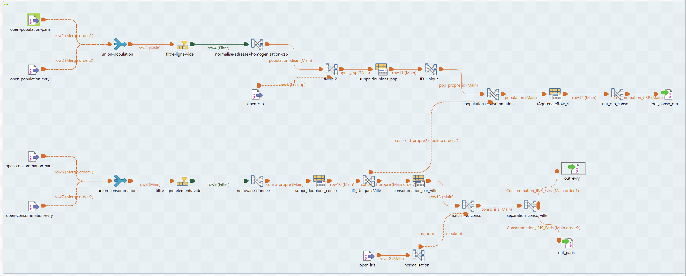

# Projet Qualité des Données : ETL Consommation Énergétique

**M2 DataScale 2025/2026** | Zoubida Kedad  
**Équipe :** Khaled Bouabdallah, Théo Joly, Mohammed Nassim Fellah, Sarah Boundaoui  
**Dernière mise à jour :** 2025-10-15

---

## 1. Décision Architecturale : Approche Union-First

**Stratégie :** Fusionner les sources tôt, transformer une fois, séparer les sorties tard.

**Pipeline :**
```
S1 (Paris) + S2 (Évry) → Union → Transform → Split → Cibles
```

**Pourquoi union-first :**
- Code unique (pas de logique dupliquée pour Paris/Évry)
- Cohérence garantie entre les sources
- Comparaison facile des sources via la colonne `Source`
- Passage à l'échelle vers de nouvelles villes sans modification du code

**Détails d'implémentation :**
- Ajout d'une colonne `Source` ('Paris' ou 'Evry') lors de l'union
- Utilisation de clés composites : `ID` → `ID_Source`, `ID_Adr` → `ID_Adr_Source`
- Filtrage par `Source` uniquement à l'étape finale pour les tables cibles séparées

---

## 2. Cartographie des Données


### Résumé des Flux

**Chemin 1 : Consommation_CSP**
```
Population (S1+S2) → Join CSP → Enrichissement avec Salaire_Moyen
   ↓
Consommation (S1+S2) → Création adresse complète
   ↓
Join sur Adresse → Group by CSP → AVG(consommation), MAX(salaire)
```

**Chemin 2 : Consommation_IRIS (Paris/Évry)**
```
Consommation (S1+S2) → Création adresse complète
   ↓
Join IRIS (ID_Rue==Nom_Rue, ID_Ville==Code_Postal)
   ↓
Group by ID_IRIS → SUM(consommation)
   ↓
Split par Source → Cible Paris, Cible Évry
```

---

## 3. Implémentation des mappings

### Copie d'écran de l'implémentation du job



L’implémentation des mappings a été réalisée à l’aide de l’ETL Talend.

### Problèmes rencontrés

Lors de l’implémentation, plusieurs difficultés ont été rencontrées :

- Formatage des adresses :  
Les adresses n’étaient pas uniformes entre les différentes sources. Nous avons donc choisi de les décomposer en plusieurs champs : numéro, nom de rue, ville et code postal.  
Nous avons également supprimé les accents, converti l’ensemble en minuscules et traité les cas particuliers où certaines adresses étaient manquantes.  
De plus, certains numéros de rue contenaient des lettres ou des suffixes tels que A, B, C, BIS ou TER, ce qui a nécessité un traitement spécifique.

- Codes postaux :  
Le format des codes postaux n’était pas toujours conforme : certains contenaient un caractère en trop ou n’étaient pas composés de cinq chiffres.

- CSP (Catégorie Socio-Professionnelle) :  
Nous avons dû gérer deux cas distincts selon les sources :
  - l’une faisait référence à l’identifiant du CSP,
  - l’autre à la description (le nom) du CSP.  
Il a donc fallu établir une correspondance entre ces deux formats à l’aide de la table de référence CSP.

- Échelles de consommation :  
Les valeurs de consommation n’étaient pas exprimées dans la même unité : certaines en Watt (W), d’autres en Kilowatt (kW). Une mise à l’échelle a donc été effectuée pour harmoniser les données.

- Normalisation des chaînes de caractères :  
Avant d’effectuer les jointures, toutes les chaînes ont été converties en minuscules et les accents supprimés afin d’éviter les divergences lors des comparaisons.

- Problèmes de jointure sur les noms de rue :  
Les formats différaient selon les sources : certaines ne contenaient que le nom de la rue, tandis que d’autres incluaient le type de voie (rue, boulevard, allée, etc.). Ce décalage a nécessité un nettoyage et une harmonisation supplémentaires avant la jointure.


## 4. Règles de Transformation

### Séparation des composants d’adresse

Pour harmoniser les données, les adresses ont été nettoyées puis décomposées en quatre éléments : numéro, nom de rue, ville et code postal.

1. Nettoyage  
Avant l’extraction, les adresses ont été normalisées :
- suppression des accents, guillemets et espaces inutiles,
- uniformisation des majuscules/minuscules,
- correction des séparateurs (espaces, virgules).

2. Extraction  
À l’aide d’expressions régulières :
- le code postal est identifié comme une suite de cinq chiffres ;
- le numéro de voie correspond à une suite de 1 à 4 chiffres, éventuellement suivie de bis, ter ou d’une lettre ;
- la ville est extraite selon sa position relative au code postal ou déduite de celui-ci (ex. 75 → Paris, 69 → Lyon) ;
- le nom de rue est obtenu après suppression des autres éléments, puis les abréviations de type de voie (av, bd, r, pl, etc.) sont remplacées par leur forme complète.

3. Gestion des cas particuliers  
Des règles de substitution complètent les valeurs manquantes (ex. déduction du code postal à partir de la ville) et garantissent une structure d’adresse uniforme.

### Stratégie de Jointure
Toutes les jointures sont **INNER** (abandon des enregistrements non correspondants) :
- Population ⋈ CSP : Suppression des codes CSP invalides
- Population ⋈ Consommation : Suppression des adresses non correspondantes
- Consommation ⋈ IRIS : Suppression des adresses hors zones IRIS

---

## 5. Plan d’Évaluation de la Qualité des Données

### 5.1 Dimensions de Qualité Considérées

Les contrôles de qualité portent sur **4 dimensions principales** issues des besoins métiers et techniques du projet :

1. **Complétude** — Vérifie la présence des valeurs obligatoires (absence de NULL).  
2. **Cohérence Syntaxique** — Contrôle le respect des formats, codifications et domaines de valeurs.  
3. **Granularité** — Assure la bonne échelle et résolution des données agrégées ou détaillées.  
4. **Doublons** — Garantit l’unicité des enregistrements et des clés.

---

### 5.2 Catalogue de Métriques

| Dimension | Nombre de Métriques | Préfixe ID | Priorité |
|------------|----------------------|-------------|-----------|
| Complétude | 14 | C001–C014 | Obligatoire |
| Cohérence Syntaxique | 9 | CS001–CS009 | Obligatoire |
| Granularité | 1 | G001 | Obligatoire |
| Doublons | 1 | D001 | Souhaitable |

**📂 Source :** Fichier [`quality_metrics.csv`](quality_metrics.csv)   
**📊 Détail complet :** chaque métrique correspond à une implémentation SQL décrite dans la colonne `Description_Implémentation`.

---

### 5.3 Catalogue Détail des Métriques

#### Complétude (`C001–C014`)
- Vérifie la présence de données dans les champs critiques des tables `Population` et `Consommation`.  
- Exemples :
  - `C001` : `Adresse` non nulle dans `Population`
  - `C002` : `CSP` non nul dans `Population`
  - `C003–C005` : `N`, `Nom_Rue`, `Code_Postal` non nuls dans `Consommation`
- Type : Contrôle colonne  
- Phase : Source  

#### Cohérence Syntaxique (`CS001–CS009`)
- Vérifie la conformité des formats et des domaines (codes postaux, formats d’identifiants, codifications CSP, etc.).  
- Implémentations sous forme d’expressions SQL régulières ou de règles de validation.  
- Phase : Source  

#### Granularité (`G001`)
- Vérifie l’échelle et la précision des données agrégées (ex. Toute les consommations en kW/H ?).  
- Phase : Transformation  

#### Doublons (`D001`)
- Détecte les doublons exacts ou fonctionnels dans les identifiants uniques.  
- Méthode : groupement + comptage d’occurrences > 1  
- Phase : Cible  

---

## 7. Risques Identifiés

| Risque | Sévérité | Statut |
|--------|----------|--------|
| Format d'adresse incompatible entre sources | 🔴 Élevé | En attente de données réelles |
| Correspondance de chaînes pour jointure IRIS (sans fuzzy matching) | 🟡 Moyen | Normalisation implémentée |
| Perte de données par INNER JOINs | 🟡 Moyen | Quantification après profilage |
| Collision d'ID entre Paris/Évry | 🟢 Faible | Clés composites préviennent cela |
| Échelles différentes (kWh vs Wh) entre sources | 🔴 Élevé | Métrique H001 pour détection |

---

## 8. Questions Ouvertes

**En attente de données réelles :**
1. Format réel des adresses dans la table Population
2. Présence de variations de noms de rue nécessitant un fuzzy matching
3. Distribution des valeurs NULL
4. Fréquence des adresses dupliquées (affecte l'hypothèse de cardinalité)
5. Unités réelles de consommation (kWh/jour vs Wh/jour) entre Paris et Évry
