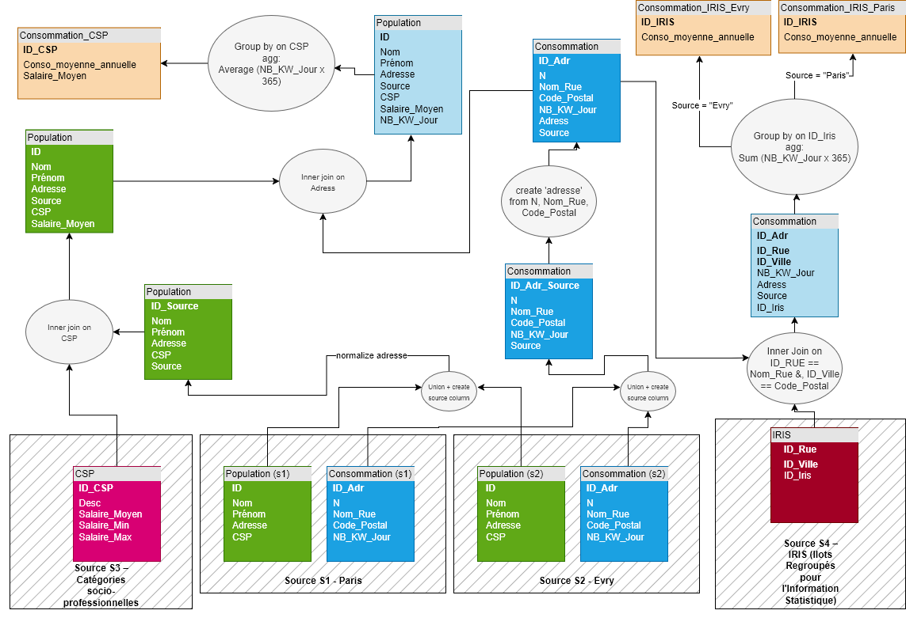

# Projet Qualité des Données : ETL Consommation Énergétique

**M2 DataScale 2025/2026** | Zoubida Kedad  
**Équipe :** Khaled Bouabdallah, Théo Joly, Boualem Mokeddem  
**Dernière mise à jour :** 2025-10-15

---

## 1. Décision Architecturale : Approche Union-First

**Stratégie :** Fusionner les sources tôt, transformer une fois, séparer les sorties tard.

**Pipeline :**
```
S1 (Paris) + S2 (Évry) → Union → Transform → Split → Cibles
```

**Pourquoi union-first :**
- Code unique (pas de logique dupliquée pour Paris/Évry)
- Cohérence garantie entre les sources
- Comparaison facile des sources via la colonne `Source`
- Passage à l'échelle vers de nouvelles villes sans modification du code

**Détails d'implémentation :**
- Ajout d'une colonne `Source` ('Paris' ou 'Evry') lors de l'union
- Utilisation de clés composites : `ID` → `ID_Source`, `ID_Adr` → `ID_Adr_Source`
- Filtrage par `Source` uniquement à l'étape finale pour les tables cibles séparées

---

## 2. Cartographie des Données



### Résumé des Flux

**Chemin 1 : Consommation_CSP**
```
Population (S1+S2) → Join CSP → Enrichissement avec Salaire_Moyen
   ↓
Consommation (S1+S2) → Création adresse complète
   ↓
Join sur Adresse → Group by CSP → AVG(consommation), MAX(salaire)
```

**Chemin 2 : Consommation_IRIS (Paris/Évry)**
```
Consommation (S1+S2) → Création adresse complète
   ↓
Join IRIS (ID_Rue==Nom_Rue, ID_Ville==Code_Postal)
   ↓
Group by ID_IRIS → SUM(consommation)
   ↓
Split par Source → Cible Paris, Cible Évry
```

---

## 3. Hypothèses Critiques

| Composant | Hypothèse | Risque si Faux | Mitigation |
|-----------|-----------|----------------|------------|
| **Jointure IRIS** | `ID_Rue` = nom de rue (texte), `ID_Ville` = code postal (texte) | Besoin d'une table de correspondance | Confirmé par l'enseignante |
| **Correspondance Adresse** | Le format Population correspond à la concaténation Consommation | Échec de jointure | Normalisation des chaînes (trim, minuscules) |
| **Cardinalité** | Relation 1:1 entre adresse et consommation | Agrégation incorrecte | Validation lors du profilage |
| **Codes CSP** | Tous les Population.CSP existent dans la table de référence CSP | Perte de données par INNER JOIN | Tracer les enregistrements supprimés |

---

## 4. Règles de Transformation

### Normalisation des Adresses
```python
# Côté Consommation
Adresse = f"{N} {Nom_Rue}, {Code_Postal}"

# Des deux côtés
Adresse = Adresse.strip().lower()
Nom_Rue = Nom_Rue.strip().lower()
Code_Postal = Code_Postal.strip()
```

### Agrégations
```sql
-- Consommation_CSP
GROUP BY CSP
  AVG(NB_KW_Jour * 365) as Conso_moyenne_annuelle
  MAX(Salaire_Moyen) as Salaire_Moyen  -- Valeur de référence, non moyennée

-- Consommation_IRIS
GROUP BY ID_IRIS  
  SUM(NB_KW_Jour * 365) as Conso_moyenne_annuelle  -- Consommation totale de la zone
```

### Stratégie de Jointure
Toutes les jointures sont **INNER** (abandon des enregistrements non correspondants) :
- Population ⋈ CSP : Suppression des codes CSP invalides
- Population ⋈ Consommation : Suppression des adresses non correspondantes
- Consommation ⋈ IRIS : Suppression des adresses hors zones IRIS

---

## 5. Plan d'Évaluation de la Qualité des Données

### 5.1 Dimensions de Qualité Considérées

Conformément aux problématiques identifiées dans le cahier des charges, nous évaluons **6 dimensions principales** :

1. **Complétude** : Présence de valeurs obligatoires (détection de valeurs NULL/manquantes)
2. **Cohérence Syntaxique** : Conformité aux formats, domaines et codifications
3. **Cohérence Sémantique** : Respect des règles métier et contraintes d'intégrité
4. **Cohérence Inter-sources** : Homogénéité des échelles et unités entre Paris et Évry
5. **Unicité** : Absence de doublons (clés primaires et doublons fonctionnels)
6. **Exactitude** : Conformité au domaine (syntaxique) et au réel (sémantique)

### 5.2 Catalogue de Métriques

Nous avons défini **60 métriques de qualité** réparties comme suit :

| Dimension | Nombre de Métriques | Préfixe ID | Priorité |
|-----------|---------------------|------------|----------|
| Complétude | 14 | C001-C014 | Obligatoire |
| Cohérence Syntaxique | 12 | CS001-CS012 | Obligatoire |
| Cohérence Sémantique | 5 | CSM001-CSM005 | Mixte |
| Cohérence Inter-sources (Hétérogénéité) | 5 | H001-H005 | Obligatoire/Souhaitable |
| Unicité | 6 | U001-U006 | Obligatoire |
| Intégrité Référentielle | 4 | I001-I004 | Obligatoire |
| Exactitude Syntaxique | 3 | ES001-ES003 | Obligatoire |
| Exactitude Sémantique | 8 | ESM001-ESM008 | Mixte |
| Traçabilité Pipeline | 4 | P001-P004 | Souhaitable |

**📊 Référence détaillée :** Voir le [catalogue complet des métriques](https://docs.google.com/spreadsheets/d/1EMn20Nz59Zi2Ow3V7qbwecvCvc7GfjbW31TBZNTFgeU/edit?usp=sharing) pour les détails d'implémentation, seuils et actions correctrices.

### 5.3 Métriques Prioritaires par Problématique

#### 📋 **Conformité à un Format, une Codification**
**Métriques clés :**
- `CS001-CS002` : Format ID (P0001, E0001)
- `CS003` : Domaine CSP (valeurs 1-6)
- `CS004-CS005` : Format code postal (75xxx, 91xxx)
- `CS011-CS012` : Validité géographique des codes postaux

**Exemple :** Détection de codes CSP invalides comme "99" au lieu de 1-6.

#### ⚖️ **Hétérogénéité des Échelles et Granularité**
**Métriques clés :**
- `H001` : **Échelle kWh S1/S2** - Ratio des moyennes Paris/Évry (détecte facteur 1000 : kWh vs Wh)
- `H002` : Coefficient de variation des salaires CSP
- `H003-H004` : Tests statistiques (Chi², Kolmogorov-Smirnov) pour comparer distributions
- `H005` : Différence relative des moyennes inter-sources

**Exemple :** Si MEAN(Paris) / MEAN(Évry) > 2.0 → alerte échelle différente (kWh vs Wh).

#### ✅ **Complétude des Données**
**Métriques clés :**
- `C001-C010` : Valeurs NULL par colonne (seuils variables selon criticité)
- `C011-C012` : Complétude des tables de référence (CSP, IRIS)
- `C013-C014` : Complétude des tables cibles après transformation

**Seuils :**
- Obligatoire (ID, NB_KW_Jour) : 0% NULL toléré
- Critique (Adresse, CSP) : < 5% NULL
- Souhaitable (Nom, Prénom) : < 10% NULL

#### 🔄 **Détection et Élimination de Doublons**
**Métriques clés :**
- `U001-U004` : Unicité des clés primaires (ID, ID_Adr, ID_CSP, ID_IRIS)
- `U005-U006` : Doublons fonctionnels (même personne/adresse, IDs différents)

**Exemple :** Détecter "Jean Martin, 10 Rue Victor Hugo, 75001" présent 2 fois avec IDs différents.

### 5.4 Métriques Additionnelles Essentielles

#### 🔗 **Intégrité Référentielle**
- `I001` : Tous les codes CSP existent dans la table de référence
- `I002` : Adresses Consommation valides dans IRIS
- `I003-I004` : Taux de réussite des jointures (> 80%)

#### 📏 **Exactitude Sémantique (Conformité au Réel)**
- `ESM001-ESM003` : Détection d'outliers (Z-score, IQR)
- `ESM004` : Salaires réalistes comparés au référentiel INSEE
- `ESM005` : Corrélation positive Salaire-Consommation attendue
- `ESM006-ESM008` : Couverture complète des CSP et zones IRIS

#### 📈 **Traçabilité du Pipeline**
- `P001-P002` : Perte de données entre entrée et sortie (< 20%)
- `P003` : Validation de l'agrégation (somme détails ≈ agrégat)
- `P004` : Présence de la colonne `Source` après union

### 5.5 Implémentation des Contrôles

**Architecture de validation :**
```
Source Data → Validation Layer → Transformation → Validation Layer → Target
     ↓                                                        ↓
  Métriques                                              Métriques
  + Issues                                               + Issues
     ↓                                                        ↓
  PostgreSQL (data_quality.metrics / data_quality.issues)
     ↓
  Streamlit Dashboard
```

**Exemples de contrôles automatisés :**

```python
# Hétérogénéité des échelles (H001)
mean_paris = df[df['Source'] == 'Paris']['NB_KW_Jour'].mean()
mean_evry = df[df['Source'] == 'Evry']['NB_KW_Jour'].mean()
ratio = mean_paris / mean_evry

if not (0.5 <= ratio <= 2.0):
    save_quality_issue(
        issue_type='scale_heterogeneity',
        severity='high',
        description=f'Ratio moyennes Paris/Evry = {ratio:.2f}'
    )

# Intégrité référentielle CSP (I001)
invalid_csp = df[~df['CSP'].isin(csp_reference['ID_CSP'])]
if len(invalid_csp) > 0:
    save_quality_issue(
        issue_type='referential_integrity',
        severity='high',
        description=f'{len(invalid_csp)} codes CSP invalides détectés'
    )
```

---

## 6. Stack Technique

| Composant | Outil | Objectif |
|-----------|-------|----------|
| Orchestration | Apache Airflow | Planification des workflows |
| Traitement | Python + Pandas | Transformation de données |
| Contrôles Qualité | Scripts personnalisés | Logique de validation |
| Stockage | PostgreSQL | Base de données métriques |
| Visualisation | Streamlit | Tableau de bord (optionnel) |

---

## 7. Risques Identifiés

| Risque | Sévérité | Statut |
|--------|----------|--------|
| Format d'adresse incompatible entre sources | 🔴 Élevé | En attente de données réelles |
| Correspondance de chaînes pour jointure IRIS (sans fuzzy matching) | 🟡 Moyen | Normalisation implémentée |
| Perte de données par INNER JOINs | 🟡 Moyen | Quantification après profilage |
| Collision d'ID entre Paris/Évry | 🟢 Faible | Clés composites préviennent cela |
| Échelles différentes (kWh vs Wh) entre sources | 🔴 Élevé | Métrique H001 pour détection |

---

## 8. Questions Ouvertes

**En attente de données réelles :**
1. Format réel des adresses dans la table Population
2. Présence de variations de noms de rue nécessitant un fuzzy matching
3. Distribution des valeurs NULL
4. Fréquence des adresses dupliquées (affecte l'hypothèse de cardinalité)
5. Unités réelles de consommation (kWh/jour vs Wh/jour) entre Paris et Évry

